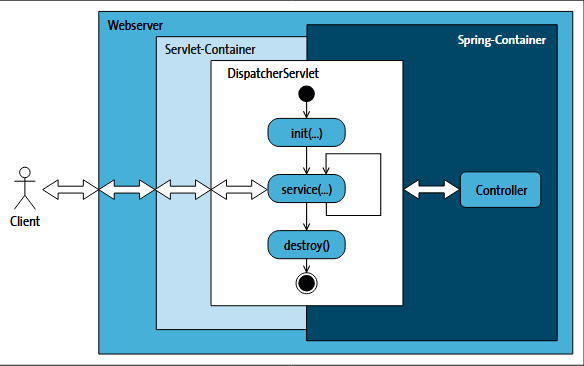

# SpringBootTraining

Projekt aufsetzen:
https://start.spring.io/

Spring Boot nutzt eine Parent-POM. (spring-boot-starter-parent)<br>
Eine Parent-POM ist eine Art »Oberklasse« für Maven-Projekte und verwaltet alle Abhängigkeiten
für ein Projekt (Konsistenz der Dependencies)
Man kann eigene Oberklassen schreiben, jedoch muss man dann prüfen ob alle Abnhängigkeiten konsistent sind.

### Dependency Erklärungen

| Name                         | Wirkung                                                                                                                         |
|------------------------------|---------------------------------------------------------------------------------------------------------------------------------|
| spring-boot-starter          | Core-Starter und bringt alles mit, was man für Spring-Boot-Anwendungen braucht                                                  |
| spring-boot-starter-jdbc     | Databasezugriffe über JDBC und DataSources (d.h. SQL selbst schreiben ohne Entities etc.)                                       |
| spring-boot-starter-data-jpa | Jakarta Persistenz (Hibernate + automatisches Entity mapping (ORM: objektrelationaler mapper)). Wenn CRUD Funktionen ausreichen |
| spring-boot-starter-json     | JSON Mapping                                                                                                                    |
| spring-boot-starter-web      | Für Webservices und dynamische Webseiten inklusive des Servlet-Containers Tomcat und Jackson Json                               |

Ausführliche Liste:
[Dependencies](https://docs.spring.io/spring-boot/reference/using/build-systems.html#using.build-systems.starters)

***
### Konfiguration in der application.properties

| Key                               | Auswirkung                    |
|-----------------------------------|-------------------------------|
| spring.main.banner-mode           | Banner Anzeige im Log steuern |
| logging.level.org.springframework | LogLevel festlegen            |

***
### Container für Spring-managed Beans (=Komponenten)

Der Spring Container ist wie ein Manager, der sich darum kümmert, dass die richtigen Objekte erstellt, miteinander verbunden und verwaltet werden. 
Er vereinfacht die Verwaltung der Objekte und Abhängigkeiten und hilft, eine saubere, wartbare Struktur in deiner Anwendung zu erhalten.

Die run Methode in der main() startet den Container.

***
### Exkurs: Domain Driven Development und Hexagonal Architecture
Domain-Driven Development ist eine Methode der Softwareentwicklung, die sich auf die Modellierung der Domäne konzentriert, in der die Anwendung arbeitet. Es geht darum, das fachliche Problem zu verstehen und den Code um die Domäne herum zu organisieren, sodass die Software die Geschäftsanwendungslogik genau abbildet.

Beispiel: Domäne im E-Commerce: Der Bereich „Online-Shop“ ist die Domäne. In dieser Domäne gibt es Fachbegriffe wie „Produkt“, „Warenkorb“, „Bestellung“, „Zahlung“, „Kunde“ etc. Die Geschäftsprozesse beinhalten die Schritte vom Produktkauf bis hin zur Bestellabwicklung und Lieferung.

Bausteine um die Domäne aufzubauen:
1. Entität: sind Objekte, die eine eigene Identität über ihren gesamten Lebenszyklus hinweg besitzen
2. Aggregat: Gruppe von Entitäten, die als Einheit betrachtet werden
3. Werteobjekt (value object): haben keine Identität, eignen sich zur Darstellung von Werten
4. Service: realisieren einen use-case und kapseln Geschäftslogik
5. Repository: übernehmen die Verantwortung für die Persistenz (z.B. Datenbanken)
6. Domain events: repräsentieren wichtige Ereignisse innerhalb der Domäne und können andere Teile des Systems informieren


Hexagonal Architecture (Zwiebelarchitekur):


Die Hexagonal Architecture, auch als Ports and Adapters-Architektur bezeichnet, ist ein Entwurfsmuster, das darauf abzielt, Software-Systeme so zu strukturieren, dass die Anwendungslogik (die Domäne) von externen Systemen (wie Datenbanken, Web-Services, UI-Frameworks usw.) isoliert wird.

**Interface:**
Bearbeitung von externen Anfragen über unterschiedliche Schnittstellen (REST, CLi, Event controller)

**Core:**
Herzstück der Anwendung, beinhaltet Domänenlogik (Entitiäten, value objects etc)

**Infrastructure:**
Ausgehende Adapter über Ports. Sie verbinden die Anwendung mit externen Systemen, z.B. Datenbanken

Daraus ergibt sich folgende Projektstruktur:


***
### Annotations
| Name                   | Auswirkung                                                                                                                                                                                                                     |
|------------------------|--------------------------------------------------------------------------------------------------------------------------------------------------------------------------------------------------------------------------------|
| @Component             | Macht eine Klasse zu einer Komponente/Spring-managed Bean. Sie wird von Spring automatisch erkannt, instanziiert. Sie ist dann aber "irgendeine" Komponente                                                                    |
| @Service               | Eine spezielle Component. Führt Busingesslogik aus                                                                                                                                                                             |
| @Repository            | Eine spezielle Component. Regelt den Datenspeicher                                                                                                                                                                             |
| @Controller            | Eine spezielle Component. Nehmen vom Frontend Aufgaben entgegen                                                                                                                                                                |
| @SpringBootApplication | Ist eine Zusammenfassung von weiteren Annotations: @SpringBootConfiguration, @EnableAutoConfiguration, @ComponentScan                                                                                                          |
| @ShellComponent        | Spezielle Komponente für interaktive Shell Programme zu schreiben                                                                                                                                                              |
| @Autowired             | Injiziert eine Abhängigkeit, damit Spring die Klassen automatisch verwalten kann                                                                                                                                               |
| @Configuration         | Spezielle Form von Component                                                                                                                                                                                                   |
| @Bean                  | Initialisierung von eigenen Fabrikmethoden                                                                                                                                                                                     |
| @PostConstruct         | Initialisierung einer Methode nach Dependency Injection                                                                                                                                                                        |
| @PreDestroy            | Ressourcen von Methoden entfernen, bevor sie vom Container entfernt werden                                                                                                                                                     |
| @DependsOn             | Abhängigkeiten von Beans bekannt machen (bei Initialisierung)                                                                                                                                                                  |
| @Lazy                  | Verzögerte Initialisierung                                                                                                                                                                                                     |
| @Conditional           | Wird an eine Bean oder Component annotiert und gibt Bedingungen für eine Initialisierung mit. Die Klasse muss Interface Condition implementieren (matches()). Es gibt in spring viele vordefinierte ConditionalOn Annotationen |
| @Value                 | Default Werte definieren. Können auch aus der application.prop stammen                                                                                                                                                         |
| @EnableCaching         | Aktiveren von Caching, kann bei einer beliebigen Configuration stehen                                                                                                                                                          |
| @Cacheable             | Caching aktivieren an einer Methode. Bsp. Mit Cache-Namen @Cacheable("file.Filesystem"). Conditions gibt es auch.                                                                                                              |

**Kontrollfluss Beispiel:**<br>
Es gibt eine Anfrage vom Client, diese
nimmt ein Controller entgegen. Der Controller delegiert die Aufgaben an den Service. Der Service benötigt Daten, er geht an das Repository; das Repository liefert die Daten in der Regel aus einer Datenbank. Die Daten gehen zurück zum Service, und dieser liefert die Daten zurück zum Controller. Ein Controller wäre eine Komponente wie ein REST-Controller für RESTful Webservices. Es könnte ebenso ein Controller für ein Command-Line-Interface oder für ein Chat-Interface sein.

*** 
### ClassPath scanning
Die Annotation SpringBootApplication ist eine Zusammenfassung von weiteren Annotations: @SpringBootConfiguration, @EnableAutoConfiguration, @ComponentScan
D.h. man kann eine Configurations-Klasse schreiben, die @SpringBootApplication als Annotation erhält.
Die wird in main als Parameter übergeben, die main darf dann aber kein @SpringBootApplication enthalten

**Beispiel:**<br>
```java
@SpringBootApplication
class Date4uConfiguration { }

public static void main( String[] args ) {
    SpringApplication.run( Date4uConfiguration.class, args );
}
```

In der neuen Configuration lassen sich z.B. mit @ComponentScan( basePackages= { "com.tutego.date4u.core" }) beschreiben, wo SpringBoot das Ursprungsverzeichnis nach Klassen für den Container suchen soll. SpringBoot sucht in den Klassen nach Annotationen und interpretiert/instanziert die Klassen automatisch.
Es gibt Filter und viel mehr.

***
### Spring shell Anwendungen
Es gibt die Möglichkeit eine Spring Shell component in einer Spring Anwendung einzubetten. D.h. eine interaktive Shell wird dadurch gestartet.

***
### Inversion of Control (IoC) und Dependency Injection
Spring kümmert sich darum, Objekte selbst zu erzeugen und ihre Abhängigkeiten bereitzustellen (injizieren) – anstatt dass du das manuell machst. (=Dependency Injection)

Inversion of Control bedeutet, dass wir die Kontrolle der Objekterzeugung an Spring abgeben.
Z.B. müsste man in Klassen mit "new" andere Klassen instanziieren, wenn diese dort abhängig sind:

```java
public class UserService {
    private UserRepository userRepository = new UserRepository();
}
```

Hier erstellt UserService selbst ein UserRepository. Das ist problematisch für Tests, Wartbarkeit und Flexibilität.

In Spring:
```java
@Service
public class UserService {
private final UserRepository userRepository;
    @Autowired  // optional ab Spring 4.3 bei nur einem Konstruktor
    public UserService(UserRepository userRepository) {
        this.userRepository = userRepository;
    }
}
```
Die @Autowired Annotation kann im Konstruktor, in einer setter Methode oder direkt im Feld angegeben werden.
Es gibt Dinge bei Felder zu beachten, z.B. darf das Feld nicht final sein etc.

Optionale Abhängigkeiten sind auch möglich und werden meist im setter angegeben z.B.
Damit kannst du Komponenten oder Services so gestalten, dass sie auch ohne bestimmte Beans funktionieren, wenn diese nicht vorhanden sind.

```java
@Autowired( required = false ) // old school
void setThumbnail( Thumbnail thumbnail ) { … }

// besser
@Autowired
@Nullable
private MyBean myBean; // Achtung myBean kann null sein und muss später geprüft werden

```
Weitere Optionen, die für den Konstruktor geeignet sind (Diese bevorzugen, vor required und nullable):
- Optional<T> (macht keine null Referenz, sondern ist einfach leer, wenn die nicht injected wird)
- ObjectProvider<T>

***
### Konfigurationsklassen und Fabrikmethoden
Neben @Component lassen sich Spring-managed Beans auf eine andere Art erzeugen.

Fabrikmethoden: Methode um eigene Instanzen aufzubauen und zurückzugeben.
Bsp:

```java
@Configuration
public class MyOwnBeanFactory {
    @Bean
    Foo methodOne(){ return ...}

    @Bean
    Bar methodTwo(){ return ...}
}
```
Die Namen der Fabrikmethoden und Klassen muss eindeutig sein. Auch in anderen Klassen. Also es darf nicht eine Fabrikmethode test in zwei unterschiedlichen Klassen geben.

Unterschied zwischen Component und Configuration:
Component registriert einfache Komponenten automatisch und ruft dabei den Konstruktor der Komponente auf.
Configuration hat eine manuelle Konfiguration und Definition von Beans. Sie sichert das Singleton-Verhalten bei @Bean Methoden.
Component könnte zu doppelten Instanzen führen. Allgemein hat man mehr Kontrolle über die Bean-Erzeugung.
Eine @Bean ist vergleichbar mit einem aufrufenden Konstruktor einen @Component.

***
### Autokonfiguration

Reihenfolge der Autokonfiguration
1. Command-Line-Args (--server.port=9090)
2. Umgebungsvariablen (SPRING_SERVER_PORT)
3. application.properties oder application.yml (im src/main/resources)
4. Profile-spezifische Dateien (application-dev.yml)
5. JAR-Dateien mit @PropertySource
6. Default-Werte in Code (@Value("${...:default}"))

Die erste gefundene Quelle gewinnt – andere werden ignoriert, falls sie denselben Schlüssel enthalten.

Profile anlegen:<br>
application.properties # Basis Konfiguration<br>
application-dev.properties # Konfiguration für DEV<br>
application-stage.properties # Konfiguration für STAGE<br>

Und eine Konfigurationsklasse. Eine Bean, die die Konfiguration abbildet

```java
@Component
@ConfigurationProperties(prefix = "app-prefix")
public class ShopConfig { ...
```
***
### Events

Events ist ein Mechanismus, um Komponenten lose zu koppeln. 
Das bedeutet: Eine Komponente kann eine Aktion (Event) auslösen, ohne zu wissen, wer darauf reagiert. 
Andere Komponenten können sich dafür „anmelden“ und entsprechend reagieren

Spring verwendet das Publisher-Subscriber-Muster:
- Publisher: Löst ein Event aus.
- Listener: Hört auf bestimmte Events und reagiert darauf.
- ApplicationEventPublisher: Spring-interne Komponente, die Events verschickt.

Es gibt auch asynchrone und vordefinierte Events.

***
### Proxy

Spring Boot verwendet oft Proxy Patterns.
D.h. ein Client greift nicht direkt auf das Zielobjekt zu, sondern kommuniziert mit einem Proxy.
Vorteil des Proxy:<br>
Operationen können Vor- und Nachbearbeitet werden. z.B. 
- Caching @Cacheable
- Transaktionsmanagement (neue Transaktionen können gestartet werden)
- Validierung (Bean validation)
- Asynchrone Aufrufe durch z.B. neue Threads, damit eine Methode nicht blockiert wird (@EnableAsync + @Async)
- Retry Mechanismus, als Rollback oder um erneut services anzusprechen (@EnableRetry, @Retryable)

***
### Datenbank Integration: JPA
Jakarta Persistence: spring-boot-starter-data-jpa
<br>Ablauf:<br>
JPA -> Hibernate ORM -> JDBC -> JDBC Treiber -> DB
<br>D.h. data-jpa enthält alles, was im Ablauf gebraucht wird (Spring Data JPA, Hibernate ORM, Spring Boot starter JDBC)

Wichtig, dass man einige Properties angibt, z.B. 
- spring.jpa.generate-ddl
- logging.level.org.hibernate.SQL=DEBUG
- logging.level.org.hibernate.orm.jdbc.bind=TRACE
- spring.jpa.properties.hibernate.format_sql=true
- spring.jpa.properties.hibernate.highlight_sql=true

**Entity-Beans**
sind Java Abbildungen einer Datenbank Tabelle.
In der Praxis beginnt man mit der Modellierung der Datenbank und erstellt dann die Entitites.
In intellij gibt es ein Plugin, das aus einer Datenbanktabelle automatisch eine Entity generiert. (JPA Buddy)

**Allgemein**
 - JDBC: Java Database Connectivity, grundlegende Schnittstelle für den Zugriff auf relationale Datenbanken. Definiert Schnittstellen wie Connection, Statement, ResultSet.
Man kann mit JDBC direkt mit der DB kommunizieren und SQL-Abfragen schreiben und ausführen. Unterste Ebene der Datenbankzugriffe in Java.
Bsp:
```java
Connection conn = DriverManager.getConnection("jdbc:mysql://localhost:3306/test", "user", "pass");
Statement stmt = conn.createStatement();
ResultSet rs = stmt.executeQuery("SELECT * FROM user");
while (rs.next()) {
    System.out.println(rs.getString("username"));
}
```
- ORM: Object-Relational Mapping, Technik zur Abbildung von Objekten auf relationale Datenbanken.
- Jakarta Persistence API (JPA): Höhere Abstraktionsebene über JDBC und Standard-API für ORM. Definiert Konzepte wie Entity, EntityManager, Query.
Ermöglicht objektorientierten Zugriff auf Daten und automatisches Mapping zwischen Java-Objekten und Datenbanktabellen.
- Konkrete Implementierung von JPA: Hibernate, EclipseLink, OpenJPA. Hibernate ist die am weitesten verbreitete Implementierung.
- Spring Data JPA: Erweiterung von Spring Data, die JPA-Repositorys und CRUD-Operationen vereinfacht. Baut auf JPA auf und integriert sich nahtlos in das Spring-Ökosystem.
- spring-boot-starter-data-jpa: Spring Boot Starter, der alle notwendigen Abhängigkeiten für die Arbeit mit JPA und Spring Data JPA bereitstellt.

Ebenen:
1) spring-boot-starter-data-jpa: 
   Stellt alle notwendigen Abhängigkeiten für JPA und Spring Data JPA bereit.
2) Spring Data JPA:
   Baut auf JPA auf und vereinfacht deren Nutzung.
   Automatisiert die Erstellung von Repositorys und CRUD-Operationen.
   Bsp: <code>UserRepository extends JpaRepository<User, Long></code>
3) JPA (Jakarta Persistence API)
   Standard-API für ORM und definiert Konzepte wie Entity, EntityManager, Query.
4) Hibernate (JPA Implementierung):
   Konkrete Implementierung von JPA, die das Mapping zwischen Java-Objekten und Datenbanktabellen übernimmt.
5) JDBC: 
   Führt SQL-Abfragen aus und verwaltet die Verbindung zur Datenbank.
6) Datenbank: Speichert Daten persistent.

Bsp:
- <code>pom.xml spring-boot-starter-data-jpa & z.B. com.h2database</code> in pom.xml
- <code>application.properties</code> ausfüllen mit DB Konfiguration
- Entity Klasse: (JPA Ebene)
```java
import jakarta.persistence.Entity;
@Entity
public class User {
    @Id
    @GeneratedValue(strategy = GenerationType.IDENTITY)
    private Long id;

    private String name;
    
    public User() {}
    // Getter und Setter
}
```
- Repository Schnittstelle: (Spring Data JPA Ebene)
  Standardoperationen werden automatisch bereitgestellt durch JpaRepository und müssen nicht angegeben werden:
  - save(User entity) 
  - findById(Long id)
  - findAll()
  - deleteById(Long id)
  - count()
```java
import org.springframework.data.jpa.repository.JpaRepository;
public interface UserRepository extends JpaRepository<User, Long> {
    List<User> findByName(String name);
}
```
- Service Klasse: (Spring Ebene)
```java
import org.springframework.stereotype.Service;
import org.springframework.beans.factory.annotation.Autowired;

@Service
public class UserService {
    private final UserRepository userRepository;

    @Autowired
    public UserService(UserRepository userRepository) {
        this.userRepository = userRepository;
    }

    public User createUser(String name) {
        User user = new User();
        user.setName(name);
        return userRepository.save(user);
    }
    
    public List<User> getUsersByName(String name) {
        return userRepository.findByName(name);
    }
}
```
Spring Data JPA ruft über ein Repository den EntitiyManager von JPA auf.
JPA ruft die Implementierung (Hibernate) auf.
Hibernate übersetzt die Operation in SQL <code>INSERT INTO users (name) VALUES ('Anna)</code> und führt sie über JDBC aus.

   
**Repository**<br>
   Ein Repository ist eine Schnittstelle, die den Zugriff auf die Datenbank kapselt.
   Es bietet CRUD-Operationen (Create, Read, Update, Delete) und ermöglicht die Definition benutzerdefinierter Abfragen.
   
***
### Spring Web
Spring Boot Web-Anwendungen werden häufig mit dem Modul spring-boot-starter-web erstellt.
Es enthält den eingebetteten Servlet-Container (standardmäßig Tomcat), sodass keine separate Installation erforderlich ist.
Möchte man dennoch einen anderen Container nutzen (z.B. Jetty oder Undertow), muss man die Abhängigkeit in der pom.xml anpassen.
Doku: https://docs.spring.io/spring-boot/how-to/webserver.html#howto.webserver.use-another

Server ports anpassen z.B.: <br>
```properties
server.port=8081
``` 
Ein Server kann auch mehrere Ports haben (z.B. HTTP und HTTPS).<br>
```properties
server.port=8080
server.additional-ports[0]=8443
server.additional-ports[0].protocol=HTTPS
```
Ein Server kann zwei Dinge machen:
1) Statische Inhalte ausliefern (HTML, CSS, JS, Bilder etc.)
2) Dynamische Inhalte generieren (Webservices, dynamische Webseiten)
Wenn ein Server über 8080 angesprochen wird, wird geprüft ob eine statische Ressource existiert. Wenn ja, wird diese ausgeliefert.
Es wird in den Verzeiczhnissen <code>static</code>, <code>public</code>, <code>resources</code> und <code>META-INF/resources</code> gesucht. 
<br>Wenn keine statische Ressource gefunden wird, wird der Request an einen Controller weitergeleitet. 
<br>Der Controller verarbeitet die Anfrage und generiert eine Antwort (z.B. JSON, HTML).

**Webjars**<br>
lassen sich über die pom einbinden und in den resources verwenden.<br>
Beispiel Bootstrap:
META-INF/resources/webjars/bootstrap/5.3.3/
<code><link rel="stylesheet"
href="webjars/bootstrap/5.3.3/dist/css/bootstrap.css"></code><br>
https://www.webjars.org/

#### SSL/TLS
TLS ist der Nachfolger von SSL und wird verwendet, um die Kommunikation zwischen Client und Server zu verschlüsseln.
Für die Verschlüsselung wird ein Zertifikat benötigt.
In Spring Boot kann man ein selbstsigniertes Zertifikat für Entwicklungszwecke erstellen:
```bashkeytool 
 keytool -genkeypair -alias myapp -keyalg RSA -keysize 2048 -storetype PKCS12 -keystore keystore.p12 -validity 3650 -storepass yourpassword
```
Das Zertifikat wird in der application.properties konfiguriert:
```properties
server.port=8443
server.ssl.key-store=classpath:keystore.p12
server.ssl.key-store-password=yourpassword
server.ssl.key-store-type=PKCS12
server.ssl.key-alias=myapp
```
Die keystore.p12 Datei wird im src/main/resources Verzeichnis abgelegt.

#### Servlet Standard
Um dynamische Inhalte zu generieren, verwendet Spring Boot den Servlet-Standard.
Ein Servlet ist ein kleines Programm innerhalb eines Servlets-Containers (z.B. Tomcat).
Der Webserver nimmt HTTP-Anfragen entgegen. Wenn statische Inhalte angefragt werden, liefert er diese direkt zurück.
Wenn dynamische Inhalte angefragt werden, leitet der Webserver die Anfrage an ein Servlet weiter.
Ein Servlet verarbeitet die Anfrage und generiert eine Antwort (z.B. HTML, JSON).
In Spring Boot werden Servlets durch Controller-Klassen implementiert.

Der Lebenszyklus eines Servlets:
1. Initialisierung: Das Servlet wird erstellt und initialisiert (init-Methode).
2. Anfrageverarbeitung: Für jede eingehende Anfrage wird die service-Methode aufgerufen.
3. Zerstörung: Wenn das Servlet nicht mehr benötigt wird, wird die destroy-Methode aufgerufen.

Ein Servlet kann mehrfach verwendet werden und wird nicht mehrfach instanziert. Es können mehrere Anfragen gleichzeitig verarbeitet werden (Multithreading).
Die service Methode startet dabei für jede Anfrage einen neuen Thread.

Servlets haben eine Anzahl an Schwächen, deswegen wird in Spring Boot meist mit **Spring Web MVC** gearbeitet.<br>
Mit Spring Web MVC wird ein DispatcherServlet bereitgestellt, der die Anfragen an Controller weiterleitet.<br>
Der DispatcherServlet ist das Herzstück von Spring Web MVC und fungiert als Front-Controller und vermittelt zwischen Client-Anfragen und den entsprechenden Controllern.



Wenn ein DispatcherServlet eine Anfrage erhält, muss es entscheiden, welcher Controller die Anfrage bearbeiten soll.<br>
Dazu verwendet es Handler Mappings, die die URL der Anfrage mit den verfügbaren Controllern abgleichen.<br>

Bsp. Handler Mappings:
```java
@RestController
@RequestMapping("/api/users")
public class UserController {
    private final UserService userService;

    public UserController(UserService userService) {
        this.userService = userService;
    }
    
    @GetMapping("/{id}") // http://localhost:8080/api/users/1
    public User getUserById(@PathVariable Long id) {
        userService.getUserById(id);
    }

    @GetMapping( "/total" ) // dasselbe wie @RequestMapping(method = RequestMethod.GET, path = "/total")
    public String totalNumberOfRegisteredUnicorns() { // http://localhost:8080/api/users/total
        return String.valueOf( userService.getTotalNumberOfRegisteredUsers() );
    }
}
```
Der Service sieht dann so aus:
```java
@Service
public class UserService {

    private final ProfileRepository profiles;

    public UserService(ProfileRepository profiles) {
        this.profiles = profiles;
    }

    // Business-Logik: Benutzer nach ID abrufen
    public User getUserById(Long id) {
        return profiles.findById(id)
                .orElseThrow(() -> new RuntimeException("User not found with id: " + id));
    }

    // Business-Logik: Gesamtzahl der registrierten Einhörner
    public long getTotalNumberOfRegisteredUsers() {
        return profiles.count();
    }
}
```

Controller greifen nur auf Services zu, die die Businesslogik enthalten. Services greifen auf Repositories zu, die die Datenbankzugriffe enthalten.
Ein Controller implementiert keine Businesslogik und keine Datenbankzugriffe direkt.
Controller sind singletons und werden nur einmal instanziert. Deswegen sollten auch keine zustandsbehafteten Felder in einem Controller verwendet werden.
Also z.B. keine Listen oder Zähler, die den Zustand über mehrere Anfragen hinweg speichern.
Ein anderer Client würde sonst den Zustand beeinflussen.

Controller -> Services -> Repositories -> Datenbank

#### HTTP Message Converter
Der HTTP Message Converter ist eine Komponente in Spring Web MVC, die dafür verantwortlich ist, HTTP-Anfragen und -Antworten in Java-Objekte zu konvertieren und umgekehrt.
Wenn eine Anfrage an einen Controller gesendet wird, verwendet der DispatcherServlet den HTTP Message Converter, um die Anfrage in das entsprechende Java-Objekt zu konvertieren.
Wenn der Controller eine Antwort zurückgibt, verwendet der HTTP Message Converter den Inhalt der Antwort, um die HTTP-Antwort zu erstellen. 
Bspiel: Wenn ein Controller eine Methode hat, die ein Java-Objekt zurückgibt, wird der HTTP Message Converter verwendet, um das Objekt in JSON zu konvertieren und in der HTTP-Antwort zurückzugeben.
Beispiel:
```java
@GetMapping("/user/{id}")
public User getUserById(@PathVariable Long id) {
    return userService.getUserById(id);
}
```
Der HTTP Message Converter konvertiert das User-Objekt in JSON und sendet es als HTTP-Antwort zurück.
Alles automatisch im Hintergrund.
Welche Converter gibt es?
- MappingJackson2HttpMessageConverter: Konvertiert Java-Objekte in JSON und umgekehrt (Standard in Spring Boot)
- MappingJackson2XmlHttpMessageConverter: Konvertiert Java-Objekte in XML und umgekehrt
- StringHttpMessageConverter: Konvertiert Strings
- FormHttpMessageConverter: Konvertiert Formulardaten
- ByteArrayHttpMessageConverter: Konvertiert Byte-Arrays

Bsp: StingHttpMessageConverter
```java
@GetMapping("/hello")
public String sayHello() {
    return "Hello, World!";
}
```
Der StringHttpMessageConverter konvertiert den String "Hello, World!" in die HTTP-Antwort. 

Bsp: XML Converter
```java
@GetMapping(value = "/user/{id}", produces = MediaType.APPLICATION_XML_VALUE)
public User getUserById(@PathVariable Long id) {
    return userService.getUserById(id);
}
```
Der MappingJackson2XmlHttpMessageConverter konvertiert das User-Objekt in XML und sendet es als HTTP-Antwort zurück.

#### Response Status
Standardmäßig gibt ein Controller eine HTTP 200 OK Antwort zurück, wenn alles erfolgreich war.
@ResponseStatus kann verwendet werden, um den HTTP-Statuscode anzupassen.
```java
@GetMapping("/user/{id}")
@ResponseStatus(HttpStatus.OK) // Standard, kann weggelassen werden
public User getUserById(@PathVariable Long id) {
    return userService.getUserById(id);
}
```
```java
@PostMapping("/user")
@ResponseStatus(HttpStatus.CREATED) // 201 Created
public User createUser(@RequestBody User user) {
    return userService.createUser(user);
}
```
```java
@DeleteMapping("/user/{id}")
@ResponseStatus(HttpStatus.NO_CONTENT) // 204 No Content
public void deleteUser(@PathVariable Long id) {
    userService.delete(user);
    // Der Service sollte Fehler abfangen und eine Exception werfen, wenn der User nicht existiert
    // Bsp:     findById(id).orElseThrow(() -> new UserNotFoundException(id));
}
```

Der Controller soll keine Exceptions fangen und behandeln. Sondern Exceptions sollen bis zum Controller durchgereicht werden.

### Spring MVC Handler-Methodenparameter – Spickzettel

| Kategorie             | Annotation / Typ                          | Zweck                                        | Beispiel |
|----------------------|-------------------------------------------|---------------------------------------------|----------|
| **URL Path**          | `@PathVariable`                           | Wert aus URL-Pfad extrahieren               | `@GetMapping("/users/{id}") public User getUser(@PathVariable Long id)` |
| **Query Parameter**   | `@RequestParam`                            | Wert aus URL-Query-String                   | `@GetMapping("/search") public List<User> search(@RequestParam String name)` |
| **Optional Query**    | `@RequestParam(required=false, defaultValue="0")` | Optionaler Parameter mit Default           | `public List<User> search(@RequestParam(defaultValue="0") int page)` |
| **Request Body**      | `@RequestBody`                             | JSON/XML/etc. in Java-Objekt                | `@PostMapping("/users") public User createUser(@RequestBody User user)` |
| **Form / Multipart**  | `@ModelAttribute`                          | Formulardaten binden                         | `@PostMapping("/register") public String register(@ModelAttribute UserForm form)` |
| **Request Header**    | `@RequestHeader`                           | HTTP Header auslesen                         | `@GetMapping("/check") public String check(@RequestHeader("X-Auth-Token") String token)` |
| **Cookie**            | `@CookieValue`                             | Cookie-Wert auslesen                         | `@GetMapping("/welcome") public String welcome(@CookieValue("sessionId") String sessionId)` |
| **Matrix Parameter**  | `@MatrixVariable`                          | Pfadsegment-Parameter `/cars;color=red`     | `@GetMapping("/cars/{id}") public Car getCar(@MatrixVariable String color)` |
| **Servlet API**       | `HttpServletRequest`, `HttpServletResponse`, `HttpSession` | Direkter Zugriff auf HTTP-Details | `public String handle(HttpServletRequest req)` |
| **Validation / Binding** | `@Valid` + `BindingResult`              | Validierung von Request Body oder Form       | `public ResponseEntity<User> createUser(@Valid @RequestBody User user, BindingResult result)` |
| **Security / Auth**   | `Principal`                                | Aktueller Benutzer                           | `public String profile(Principal principal)` |
| **Paging / Sorting**  | `Pageable`, `Sort`                          | Pagination/Sortierung                        | `public Page<User> listUsers(Pageable pageable)` |
| **Locale**            | `Locale`                                   | Aktuelle Sprache / Region                    | `public String greeting(Locale locale)` |

---

#### Tipps

1. `@RestController` → alle Methoden automatisch `@ResponseBody`.
2. Kombinierbar: z.B. `@RequestParam` + `@PageableDefault`.
3. `HttpMessageConverter` kümmert sich um `@RequestBody` → JSON automatisch in Java-Objekt.
4. Für sauberes Fehlerhandling: Exceptions im Service werfen → `@ControllerAdvice` behandeln.

**Data Transfer Objects (DTOs)**<br>
DTOs sind einfache Java-Klassen, die nur Daten enthalten (keine Geschäftslogik).
Sie werden verwendet, um Daten zwischen verschiedenen Schichten einer Anwendung zu übertragen, z.B. zwischen dem Controller und dem Service.
DTOs helfen dabei, die Datenstruktur zu definieren, die über die API gesendet und empfangen wird.
Sie können auch verwendet werden, um nur die benötigten Daten zu übertragen und sensible Informationen auszublenden.
Beispiel DTO:
```java
public class UserDTO {
    private Long id;
    private String name;
    private String email;
    // Getter und Setter
}
```
DTO im Controller:
```java
@GetMapping("/user/{id}")
public UserDTO getUserById(@PathVariable Long id) {
    return userService.getUserById(id);
}
```
DTO im Service:
```java
public UserDTO getUserById(Long id) {
    User user = userRepository.findById(id).orElseThrow(() -> new UserNotFoundException(id));
    UserDTO dto = new UserDTO();
    dto.setId(user.getId());
    dto.setName(user.getName());
    dto.setEmail(user.getEmail());
    return dto;
}
```
Man auch Mapper-Bibliotheken wie MapStruct oder ModelMapper verwenden, um die Konvertierung zwischen Entitäten und DTOs zu automatisieren.
Vorteil der mapper: Weniger Boilerplate-Code, einfachere Wartbarkeit.

**`Optional<T>`**<br>
Optional ist ein Container-Objekt, das entweder einen Wert enthält oder leer ist.
Es wird verwendet, um NullPointerExceptions zu vermeiden und den Umgang mit optionalen Werten zu erleichtern.
<br>Beispiel:
```java
public interface UserRepository extends JpaRepository<User, Long> {
    Optional<User> findById(Long id);
}
```
Tipps:
- Nicht als Feld oder Parameter verwenden – nur für Rückgaben.
- Nie Optional.get() ohne isPresent() – kann NPE werfen.
- Gut kombinierbar mit Streams – z. B. map, flatMap, filter.
- In DTOs / JSON vermeiden – nur intern zwischen Schichten benutzen.

#### Exception Handling

Controller sollen in Spring Boot keine Fehlerbehandlung direkt übernehmen.
Sie sollen nur Anfragen entgegennehmen und Antworten liefern, nicht Business- oder Fehlerlogik steuern.

Bsp:
<br>Controller
```java
@GetMapping("/user/{id}")
public User getUserById(@PathVariable Long id) {
    return userService.getUserById(id); // Clean, keine Fehlerbehandlung
}
```
<br>Service
```java
public User getUserById(Long id) {
    return userRepository.findById(id)
        .orElseThrow(() -> new UserNotFoundException("User not found with id: " + id));
}
```
<br>Custom Exception - im exception Paket
```java
public class UserNotFoundException extends RuntimeException {
    public UserNotFoundException(Long id) {
        super("User mit ID " + id + " wurde nicht gefunden");
    }
}
```
<br>Global Exception Handler - im exception Paket
```java
@ControllerAdvice
public class GlobalExceptionHandler {
    @ExceptionHandler(UserNotFoundException.class)
    @ResponseStatus(HttpStatus.NOT_FOUND)
    public ResponseEntity<String> handleUserNotFound(UserNotFoundException ex) {
        return new ErrorResponse(404, ex.getMessage(), LocalDateTime.now());
    }
}
```
Error response DTO - im DTO Paket
```java
public class ErrorResponse {
    private int status;
    private String message;
    private LocalDateTime timestamp;
    // Konstruktor, Getter, Setter
}
```
***
### Webservices und Restful APIs
Webservices sind Dienste, die über das Web kommunizieren und Daten austauschen.
REST ist im Grunde nicht anderes als CRUD Operationen auf Datenbanken über HTTP.
Die Kommunikation muss immer zustandslos sein (stateless). D.h. der Server speichert keinen Zustand zwischen den Anfragen.
Jede Anfrage vom Client muss alle Informationen enthalten, die der Server benötigt, um die Anfrage zu verarbeiten.

## GraphQL
Problem bei REST: Möchte man verschiedene Daten von verschiedenen Endpunkten abrufen, muss man mehrere Anfragen machen.
Diese Anfragen können zu Overfetching (zu viele Daten) oder Underfetching (zu wenige Daten) führen.
Beispiel, Email und lastSeen Status eines Users abrufen. Die Infos sind aber in unterschiedlichen Endpunkten:
- GET /api/users/1 liefert z.B. John, test@test.de, 1 (user ID)
- GET /api/userstatus/1 liefert z.B. online, 2024-06-01T12:00:00 (last seen)

GraphQL löst dieses Problem, indem es dem Client ermöglicht, genau die Daten anzufordern, die er benötigt, in einer einzigen Anfrage.
GraphQL verwendet ein einziges Endpunkt (z.B. /graphql) für alle Anfragen.
Clients senden Abfragen, die die Struktur der gewünschten Daten definieren.
Der Server verarbeitet die Abfrage und gibt nur die angeforderten Daten zurück.

Bsp:
```graphql
query {
  user(id: 1) {
    email
    status {
        lastSeen
    }
  }
}
```
Antwort:
```json
{
  "data": {
    "user": {
      "email": "test@test.de",
      "status": {
        "lastSeen": "2024-06-01T12:00:00"
      }
    }
  }
}
```
GraphQL bietet auch Vorteile wie:
- Starke Typisierung: Das Schema definiert die Struktur der Daten und die verfügbaren Operationen.
- Echtzeit-Updates: Mit Subscriptions können Clients Echtzeit-Daten erhalten.
- Selbstbeschreibend: Das Schema dient als Dokumentation für die API.

Einbindung in Spring Boot:
1. Abhängigkeiten in pom.xml hinzufügen:
   `<groupId>org.springframework.boot</groupId>
   <artifactId>spring-boot-starter-graphql</artifactId>`
2. GraphQL Schema definieren (z.B. src/main/resources/graphql/schema.graphqls im resources Verzeichnis):
```graphql
type Query {
  user(id: ID!): User
}
type User {
  id: ID!
  email: String!
  status: UserStatus
}
type UserStatus {
  lastSeen: String!
}
```
3. Resolver implementieren:
```java
@Component
public class UserResolver implements GraphQLQueryResolver {
    private final UserService userService;
    public UserResolver(UserService userService) {
        this.userService = userService;
    }
    public User getUser(Long id) {
        return userService.getUserById(id);
    }
}
```
4. GraphQL Endpunkt konfigurieren (standardmäßig /graphql):
```properties
spring.graphql.path=/graphql
```
***
### Asynchrone / zeitintensive Requests
Webserver nehmen Anfragen in Threads entgegen. (Worker Threads)
Wenn eine Anfrage lange dauert (z.B. Datenbankzugriff, PDF Generierung etc.), können bei viele weiteren Anfragen alle Threads belegt sein.
Die Anfragen müssen warten, bis ein Thread wieder frei wird. Das führt zu Timeouts und schlechter Performance.
Asynchrone Requests lösen dieses Problem, indem sie die Verarbeitung einer Anfrage in einen separaten Thread auslagern.
Der ursprüngliche Thread wird sofort freigegeben, um weitere Anfragen zu bearbeiten.
Wenn die Verarbeitung abgeschlossen ist, wird das Ergebnis zurückgegeben.
Spring MVC liefert dabei:
- `DeferredResult<V>`: Ein Platzhalter für ein Ergebnis, das später bereitgestellt wird.
- `WebAsyncTask<V>`: Erweiterte Steuerung über Timeout und Fehlerbehandlung.
- `Callable<V>`: Eine Methode, die einen Wert zurückgibt.
Beispiel:
```java
@GetMapping("/async-callable")
public Callable<String> asyncCallable() {
    return () -> {
        // Lange laufende Aufgabe
        Thread.sleep(5000);
        return "Fertig!";
    };
}
```
Wenn der Return Typ `Callable` ist, wird die Methode in einem separaten Thread ausgeführt.

***
### Bean validation
Bean Validation ist ein Standard zur Validierung von Java-Objekten.
In Spring Boot wird Bean Validation häufig in Kombination mit JPA-Entitäten und DTOs verwendet.
Die Validierung erfolgt durch Annotationen, die auf Felder oder Methoden angewendet werden.
Beispiel:
```java
import jakarta.validation.constraints.NotNull;
import jakarta.validation.constraints.Size;
public class UserDTO {
    @NotNull(message = "Name darf nicht null sein")
    @Size(min = 2, max = 50, message = "Name muss zwischen 2 und 50 Zeichen lang sein")
    private String name;

    @NotNull(message = "Email darf nicht null sein")
    @Email(message = "Email muss ein gültiges Format haben")
    private String email;
    // Getter und Setter
}
```
Um die Validierung in einem Controller zu aktivieren, wird die `@Valid` Annotation verwendet:
```java
@PostMapping("/users")
public ResponseEntity<UserDTO> createUser(@Valid @RequestBody UserDTO userDTO, BindingResult result) {
    if (result.hasErrors()) {
        // Fehlerbehandlung
    }
    // Benutzer erstellen
}
```
Wenn die Validierung fehlschlägt, werden die Fehler im `BindingResult` Objekt gespeichert.
Einbinden in der pom.xml:
```xml
<dependency>
    <groupId>org.springframework.boot</groupId>
    <artifactId>spring-boot-starter-validation</artifactId>
</dependency>
```
***
### Resource ID / UUID
In RESTful APIs ist es üblich, Ressourcen über eindeutige Identifikatoren (IDs) zu adressieren.
Diese IDs können numerisch (z.B. 1, 2, 3) oder UUIDs (Universally Unique Identifiers) sein.
UUIDs sind 128-Bit-Werte, die weltweit eindeutig sind.
Sie werden häufig verwendet, um Kollisionen zu vermeiden, insbesondere in verteilten Systemen und werden nicht durch erraten vorhersehbar.
In Spring Boot können UUIDs als Pfadvariablen verwendet werden:
```java
@GetMapping("/users/{id}")
public User getUserById(@PathVariable UUID id) {
    return userService.getUserById(id);
}
```
In der Entity-Klasse kann das ID-Feld als UUID definiert werden:
```java
import jakarta.persistence.Id;
import jakarta.persistence.GeneratedValue;
import jakarta.persistence.GenerationType;
import java.util.UUID;
@Entity
public class User {
    @Id
    @GeneratedValue(strategy = GenerationType.AUTO)
    private UUID id;
    private String name;
    // Getter und Setter
}
```
Beim Erstellen einer neuen Ressource wird die UUID automatisch generiert.
```java
@PostMapping("/users")
public User createUser(@RequestBody User user) {
    return userRepository.save(user);
}
```
***
### Versionierung von APIs
Versionierung ist wichtig, um Änderungen an einer API vorzunehmen, ohne bestehende Clients zu brechen.
Es gibt verschiedene Strategien zur Versionierung von APIs:
1. URL-Versionierung: Die Version wird in der URL angegeben.
   Beispiel: `/api/v1/users`, `/api/v2/users`
2. Header-Versionierung: Die Version wird im HTTP-Header angegeben.
   Beispiel: `Accept: application/vnd.myapp.v1+json`
3. Query-Parameter-Versionierung: Die Version wird als Query-Parameter angegeben.
   Beispiel: `/api/users?version=1`
In Spring Boot kann die URL-Versionierung einfach durch unterschiedliche Controller-Klassen oder unterschiedliche `@RequestMapping` Pfade umgesetzt werden:
```java
@RestController
@RequestMapping("/api/v1/users")
public class UserControllerV1 {
    // Endpunkte für Version 1
}
@RestController
@RequestMapping("/api/v2/users")
public class UserControllerV2 {
    // Endpunkte für Version 2
}
```
***
### Spring Security
Spring Security ist ein leistungsstarkes und hochgradig anpassbares Framework zur Sicherung von Web-Anwendungen.
Es bietet Authentifizierungs- und Autorisierungsfunktionen, um den Zugriff auf Ressourcen zu kontrollieren.
In Spring Boot kann Spring Security einfach durch Hinzufügen der Abhängigkeit in der pom.xml aktiviert werden:
```xml
<dependency>
    <groupId>org.springframework.boot</groupId>
    <artifactId>spring-boot-starter-security</artifactId>
</dependency>
```
Für Authentifizierung gibt es zwei Hauptansätze:
Authorization-Header mit späterem Cookie-Austausch oder Token-basierte Authentifizierungen (JWT).
Spring Security konfiguriert standardmäßig eine einfache HTTP-Basic-Authentifizierung.
Tokens lassen sich in einem Microservice-Architektur gut verwenden, da sie zustandslos sind.
Cookies dagegen sind zustandsbehaftet und müssen serverseitig verwaltet werden.

***
### Logging