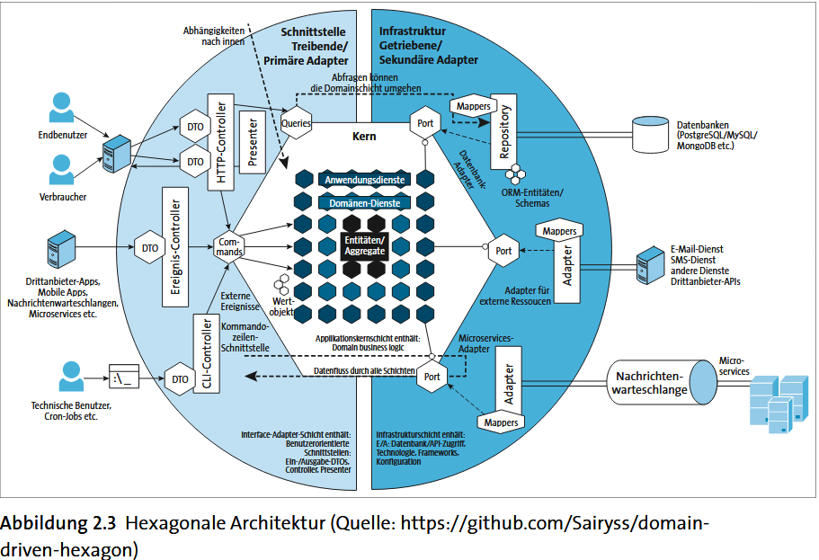
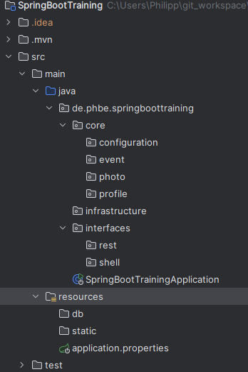

# SpringBootTraining

Projekt aufsetzen:
https://start.spring.io/

Spring Boot nutzt eine Parent-POM. (spring-boot-starter-parent)<br>
Eine Parent-POM ist eine Art »Oberklasse« für Maven-Projekte und verwaltet alle Abhängigkeiten
für ein Projekt (Konsistenz der Dependencies)
Man kann eigene Oberklassen schreiben, jedoch muss man dann prüfen ob alle Abnhängigkeiten konsistent sind.

### Dependency Erklärungen

| Name                         | Wirkung                                                                                        |
|------------------------------|------------------------------------------------------------------------------------------------|
| spring-boot-starter          | Core-Starter und bringt alles mit, was man für Spring-Boot-Anwendungen braucht                 |
| spring-boot-starter-jdbc     | Databasezugriffe über JDBC und DataSources                                                     |
| spring-boot-starter-data-jpa | Jakarta Persistenz                                                                             |
| spring-boot-starter-json     | JSON Mapping                                                                                   |
| spring-boot-starter-web      | Für Webservices und dynamische Webseiten inklusive des Servlet-Containers Tomcat               |

Ausführliche Liste:
[Dependencies](https://docs.spring.io/spring-boot/reference/using/build-systems.html#using.build-systems.starters)

***
### Konfiguration in der application.properties

| Key                               | Auswirkung                    |
|-----------------------------------|-------------------------------|
| spring.main.banner-mode           | Banner Anzeige im Log steuern |
| logging.level.org.springframework | LogLevel festlegen            |

***
### Container für Spring-managed Beans (=Komponenten)

Der Spring Container ist wie ein Manager, der sich darum kümmert, dass die richtigen Objekte erstellt, miteinander verbunden und verwaltet werden. 
Er vereinfacht die Verwaltung der Objekte und Abhängigkeiten und hilft, eine saubere, wartbare Struktur in deiner Anwendung zu erhalten.

Die run Methode in der main() startet den Container.

***
### Exkurs: Domain Driven Development und Hexagonal Architecture
Domain-Driven Development ist eine Methode der Softwareentwicklung, die sich auf die Modellierung der Domäne konzentriert, in der die Anwendung arbeitet. Es geht darum, das fachliche Problem zu verstehen und den Code um die Domäne herum zu organisieren, sodass die Software die Geschäftsanwendungslogik genau abbildet.

Beispiel: Domäne im E-Commerce: Der Bereich „Online-Shop“ ist die Domäne. In dieser Domäne gibt es Fachbegriffe wie „Produkt“, „Warenkorb“, „Bestellung“, „Zahlung“, „Kunde“ etc. Die Geschäftsprozesse beinhalten die Schritte vom Produktkauf bis hin zur Bestellabwicklung und Lieferung.

Bausteine um die Domäne aufzubauen:
1. Entität: sind Objekte, die eine eigene Identität über ihren gesamten Lebenszyklus hinweg besitzen
2. Aggregat: Gruppe von Entitäten, die als Einheit betrachtet werden
3. Werteobjekt (value object): haben keine Identität, eignen sich zur Darstellung von Werten
4. Service: realisieren einen use-case und kapseln Geschäftslogik
5. Repository: übernehmen die Verantwortung für die Persistenz (z.B. Datenbanken)
6. Domain events: repräsentieren wichtige Ereignisse innerhalb der Domäne und können andere Teile des Systems informieren


Hexagonal Architecture (Zwiebelarchitekur):


Die Hexagonal Architecture, auch als Ports and Adapters-Architektur bezeichnet, ist ein Entwurfsmuster, das darauf abzielt, Software-Systeme so zu strukturieren, dass die Anwendungslogik (die Domäne) von externen Systemen (wie Datenbanken, Web-Services, UI-Frameworks usw.) isoliert wird.

**Interface:**
Bearbeitung von externen Anfragen über unterschiedliche Schnittstellen (REST, CLi, Event controller)

**Core:**
Herzstück der Anwendung, beinhaltet Domänenlogik (Entitiäten, value objects etc)

**Infrastructure:**
Ausgehende Adapter über Ports. Sie verbinden die Anwendung mit externen Systemen, z.B. Datenbanken

Daraus ergibt sich folgende Projektstruktur:



***
### Annotations
| Name                   | Auswirkung                                                                                                                                                  |
|------------------------|-------------------------------------------------------------------------------------------------------------------------------------------------------------|
| @Component             | Macht eine Klasse zu einer Komponente/Spring-managed Bean. Sie wird von Spring automatisch erkannt, instanziiert. Sie ist dann aber "irgendeine" Komponente |
| @Service               | Eine spezielle Component. Führt Busingesslogik aus                                                                                                          |
| @Repository            | Eine spezielle Component. Regelt den Datenspeicher                                                                                                          |
| @Controller            | Eine spezielle Component. Nehmen vom Frontend Aufgaben entgegen                                                                                             |
| @SpringBootApplication | Ist eine Zusammenfassung von weiteren Annotations: @SpringBootConfiguration, @EnableAutoConfiguration, @ComponentScan                                       |
| @ShellComponent        | Spezielle Komponente für interaktive Shell Programme zu schreiben                                                                                           |
| @Autowired             | Injiziert eine Abhängigkeit, damit Spring die Klassen automatisch verwalten kann                                                                            |

**Kontrollfluss Beispiel:**<br>
Es gibt eine Anfrage vom Client, diese
nimmt ein Controller entgegen. Der Controller delegiert die Aufgaben an den Service. Der Service benötigt Daten, er geht an das Repository; das Repository liefert die Daten in der Regel aus einer Datenbank. Die Daten gehen zurück zum Service, und dieser liefert die Daten zurück zum Controller. Ein Controller wäre eine Komponente wie ein REST-Controller für RESTful Webservices. Es könnte ebenso ein Controller für ein Command-Line-Interface oder für ein Chat-Interface sein.

*** 
### ClassPath scanning
Die Annotation SpringBootApplication ist eine Zusammenfassung von weiteren Annotations: @SpringBootConfiguration, @EnableAutoConfiguration, @ComponentScan
D.h. man kann eine Configurations-Klasse schreiben, die @SpringBootApplication als Annotation erhält.
Die wird in main als Parameter übergeben, die main darf dann aber kein @SpringBootApplication enthalten

**Beispiel:**<br>
```java
@SpringBootApplication
class Date4uConfiguration { }

public static void main( String[] args ) {
    SpringApplication.run( Date4uConfiguration.class, args );
}
```

In der neuen Configuration lassen sich z.B. mit @ComponentScan( basePackages= { "com.tutego.date4u.core" }) beschreiben, wo SpringBoot das Ursprungsverzeichnis nach Klassen für den Container suchen soll. SpringBoot sucht in den Klassen nach Annotationen und interpretiert/instanziert die Klassen automatisch.
Es gibt Filter und viel mehr.

***
### Spring shell Anwendungen
Es gibt die Möglichkeit eine Spring Shell component in einer Spring Anwendung einzubetten. D.h. eine interaktive Shell wird dadurch gestartet.

***
### Inversion of Control (IoC) und Dependency Injection
Spring kümmert sich darum, Objekte selbst zu erzeugen und ihre Abhängigkeiten bereitzustellen (injizieren) – anstatt dass du das manuell machst. (Dependency Injection)

Inversion of Control bedeutet, dass wir die Kontrolle der Objekterzeugung an Spring abgeben.
Z.B. müsste man in Klassen mit "new" andere Klassen instanziieren, wenn diese dort abhängig sind:

```java
public class UserService {
    private UserRepository userRepository = new UserRepository();
}
```

Hier erstellt UserService selbst ein UserRepository. Das ist problematisch für Tests, Wartbarkeit und Flexibilität.

In Spring:
```java
@Service
public class UserService {
private final UserRepository userRepository;
    @Autowired  // optional ab Spring 4.3 bei nur einem Konstruktor
    public UserService(UserRepository userRepository) {
        this.userRepository = userRepository;
    }
}
```
Die @Autowired Annotation kann im Konstruktor, in einer setter Methode oder direkt im Feld angegeben werden.
Es gibt Dinge bei Felder zu beachten, z.B. darf das Feld nicht final sein etc.

Optionale Abhängigkeiten sind auch möglich und werden meist im setter angegeben z.B.
Damit kannst du Komponenten oder Services so gestalten, dass sie auch ohne bestimmte Beans funktionieren, wenn diese nicht vorhanden sind.

```java
@Autowired( required = false ) // old school
void setThumbnail( Thumbnail thumbnail ) { … }

// besser
@Autowired
@Nullable
private MyBean myBean; // Achtung myBean kann null sein und muss später geprüft werden

```
Weitere Optionen, die für den Konstruktor geeignet sind (Diese bevorzugen, vor required und nullable):
- Optional<T> (macht keine null Referenz, sondern ist einfach leer, wenn die nicht injected wird)
- ObjectProvider<T>
